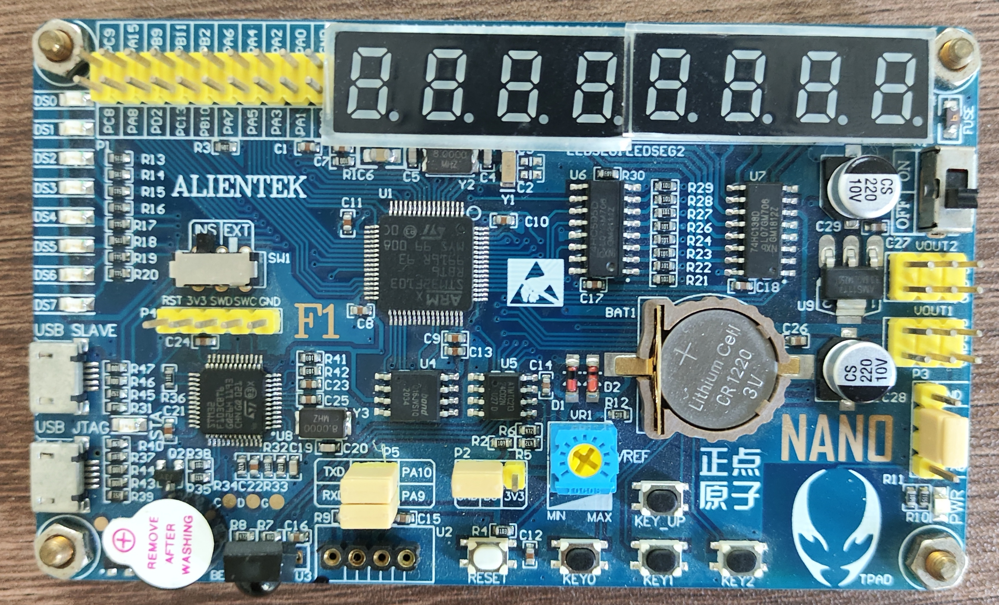

# ALIENTEK NANO STM32F103 Examples



## Build & Flash

- Install Rust.
- Install `cargo-flash` and [configure it](https://probe.rs/docs/getting-started/probe-setup/) for your platform.

```txt
cargo install cargo-flash
```

- Build and flash.

```txt
cargo flash --chip STM32F103RB -p <package> [--release]
```

## Debug

- Install `OpenOCD` and `arm-none-eabi-gdb`(or `gdb-multiarch`, which needs to be configured in `.vscode/launch.json`) on your system.
- Install [Cortex-Debug](https://marketplace.visualstudio.com/items?itemName=marus25.cortex-debug) for VS Code.
